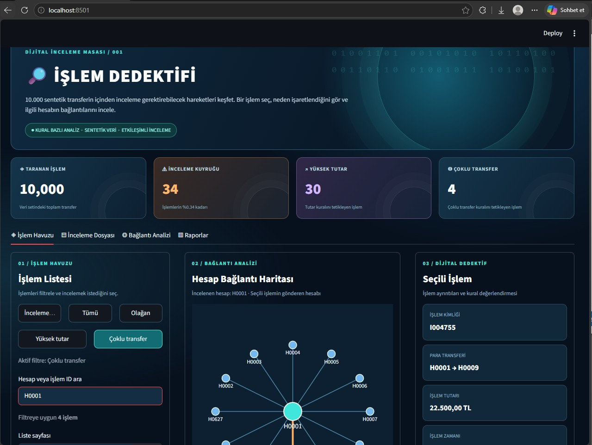
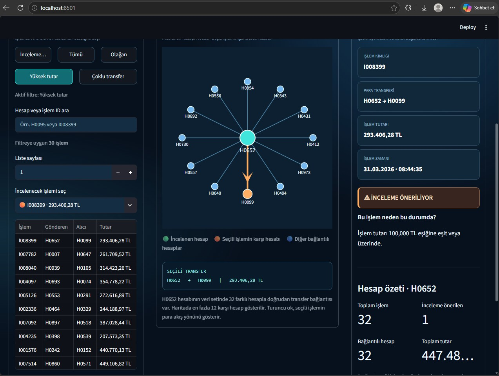

# 🔎 İşlem Dedektifi
İşlem Dedektifi, tamamen eğitim amaçlı hazırlanan verileri kullanılarak geliştirilmiş bir Python veri analizi ve görselleştirme projesidir.
İşlem hareketlerini belirlenen kurallar doğrultusunda analiz etmek, inceleme gerektirebilecek örnek işlemleri işaretlemek ve sonuçları etkileşimli bir arayüz üzerinden incelemektir.

## 🎯 Projenin Amacı
Bankacılık deneyimimi Python ve veri analizi ile bir araya getirdiğim bu projede:
- Yüksek tutarlı işlemler analiz edilir.
- Kısa süre içerisinde aynı hesaptan yapılan çoklu transferler incelenir.
- Tanımlanan kuralları tetikleyen işlemler işaretlenir.
- Analiz sonuçları etkileşimli bir kontrol ekranında görüntülenir.
- Hesaplar arasındaki işlem bağlantıları görselleştirilir.

## 🧩 Proje Akışı
**1. Veri Üretimi** `veri_uret.py`
Tamamen hayalî hesaplardan oluşan eğitim amaçlı hazırlanan veri seti oluşturur. Projede 1.000 sentetik hesap ve 10.000 sentetik işlem üretilmektedir.

**2. İşlem Analizi** `analiz_motoru.py`
İşlemleri örnek inceleme kurallarına göre analiz eder.

Kullanılan temel kurallar:
- 100.000 TL ve üzerindeki işlemler
- Aynı gönderen hesaptan 10 dakika içerisinde en az 5 transfer yapılması
Bu kuralları tetikleyen işlemler inceleme için işaretlenir.

**3. Görselleştirme** `uygulama.py`, `dedektif_v2.py` ve `dedektif_v3.py`
Streamlit kullanılarak geliştirilen farklı arayüz sürümleridir. Analiz sonuçlarının filtrelenmesini, işlem detaylarının incelenmesini ve işlem bağlantılarının görselleştirilmesini sağlar.

## 🛠️ Kullanılan Teknolojiler
- Python
- Pandas
- NumPy
- Streamlit
- Plotly

## 📁 Proje Dosyaları
- `veri_uret.py` — eğitim amaçlı hazırlanan hesap ve işlem verilerinin oluşturulması
- `analiz_motoru.py` — kural tabanlı işlem analizi
- `uygulama.py` — ilk kontrol merkezi arayüzü
- `dedektif_v2.py` — geliştirilmiş arayüz
- `dedektif_v3.py` — geliştirilmiş dijital inceleme masası

- ## 📸 Uygulama Görüntüleri

